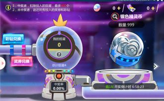
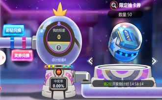
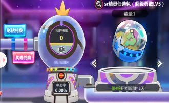
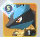
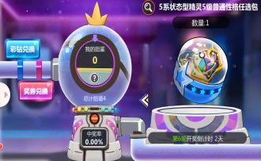

## 终极扭蛋（6轮）

这个推荐所有玩家都去参与，只要100彩钻就能参与抽奖，要是六轮都没中奖会**返还所有彩钻**

## 第一轮（T0）

  
**银色精灵币*999**  
抽取**银币卡池** ，银币抽卡1积分，卡池中最多抽到3级性格，80次保底一个SSR，相当于十多个SSR材料（可以用**心愿单**指定特定SSR）。抽到这一轮的好处是：  
1.可以帮助你占领**抽卡排行**，获取大量资源  
2.抽银币的宠物可以在前期当做**天赋材料**喂养  
3.抽银币的宠物能快速完成N,R,SR的**收集册**解锁  
4.可以配合开通**抽卡特权周卡**，增加心愿单机会，快速获得想要的SSR。  

## 第二轮（T2） 
  
**限定抽卡券（卡带）50**    
抽取**卡带卡池**，卡带抽卡10积分，卡池中可以抽到5级性格（满性格），10抽保底一个5级性格，45抽保底一个SSR（SSR保底和5级性格保底最多同时出现1个）。抽到这一轮相当于保底一个SSR，有概率五闪SSR（非常低），性价比相对于第一轮差许多。

## 第三轮（T2） 
  
**精英百变怪*3**  
性价比一般
三个精英百变怪（紫百变），精英百变怪相当于任意宠物的升星材料（推荐给稀有SSR）

## 第四轮（T3） 
  
**SR精灵任选包**  
性价比一般，不过平民可以冲这一轮，选择功能性较强的SR  
T0**蒂安希**  ，**路卡利欧**   
T1 **梦幻**（**激励**功能宠，适配**超级巨钳螳螂**等重击爆发宠物）   
**卡比兽**（可以抽R卡五闪升级，较容易获得）   
**烈咬陆鲨**（可以抽R卡五闪升级，较容易获得）   
T2 剩下的根据自己玩的阵容选择主力SR五闪（放在T2是因为后续都有**对应SP**替代，SP是SR的强化版，烈咬陆鲨不在此列是因为他的综合能力不算太落后SP，平民神宠）

## 第五轮（T0） 
  
**善恶有报**  
强烈推荐，**善恶有报**是648氪金学习机，后续除了氪金没有其他获取途径

## 第六轮（T1）
  
**5系状态精灵5级普通性格包**  
状态宠物走防御路线比较合适，这里推荐忧郁（减伤）慎重（每回合获得护盾）和冷静（每回合回血）这三个性格，优先忧郁。
  

[def]: florian-klauer-nptLmg6jqDo-unsplash.jpg
[def2]: 41.jpgD:\Hugo\zhulang\content\post\新区扭蛋\41.jpg