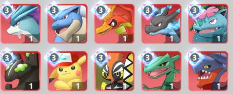

## 新区攻略活动篇

## 活动时间（按活动开放时间排序）

## 第一天开放
**抽卡排行**(一共三轮，分别在第1，2，3天)
第一轮的奖励是精英百变怪（紫百变），第一名4个，精英百变怪相当于任意宠物的升星材料（推荐给稀有SSR），推荐这轮，前期比较重要。  
第二轮的奖励是SSR性格任选包，第一名4级普通性格,这一轮的奖励比较鸡肋。  
第三轮的奖励是闪光SSR任选包，第一名3级闪光性格。这一轮要是拿不到第一就不要抢，闪光性格3级和5级有额外效果。（注：3级闪光在后期并不难获得，比如**限时岛屿**等活动，但是前期获得如固拉多3闪的话，优势又会很大，有能力的玩家根据自身需求冲第一轮或第三轮）
  
  

**定制精灵**（一共三轮，分别是在第1，3，7天）（常驻活动）注：目前是1，5，9天，游戏人员说是BUG后续会修    
第一轮 一级普通性格 火水电毒的状态宠物和通用宠物    
第二轮 三级普通性格(V2才能选择龙队)    
第三轮 四级普通性格(V8能定制四级闪光宠物)  

火队是mega喷火龙和凤王  
水队是水君和mega水箭龟  
电队是皮神和卡噗鸣鸣  
毒队是基格尔德和mega妙蛙花  
龙队是裂空座和mega烈咬陆鲨  
通用的输出是帝牙卢卡，卡噗哞哞  
防御是洛奇亚，鬼龙  
辅助是时拉比和卡噗蝶蝶    

推荐：时拉比（手动减能量），龙队（优先mega烈咬陆鲨）,水队(优先水君)    

**终极扭蛋**（一共六轮，开服开始计时，每8小时一轮，在第一和第三天内）  
需要投入彩钻参与，100彩钻一个扭蛋，每轮中奖概率为你投入的扭蛋/区内所有的扭蛋  
这个推荐所有玩家都去参与，只要100彩钻就能参与抽奖，要是六轮都没中奖会**返还所有彩钻**  

**新服抽卡**（活动仅在1-3天）
这个就是彩钻买卡带3折，每张卡带350彩钻打折到105彩钻，性价比氪佬和差点分冲榜的可以考虑一下，整体不推荐  

**开服嘉年华**(一共两轮，分别在第一周和第二周)
第一轮最终奖励SSR凤王  
第二轮最终奖励**金色战意**（新服稀缺资源）  
第二轮的时候每天有单日累充活动（6元档和30元档）  
嘉年华活动礼包，钻石礼包全买（钻石学习机礼包选择战意），彩钻买卡带礼包不推荐，彩钻买百变怪礼包推荐。  

## 第四天开放
**SP卡池**  
SP池子相比于卡带池子多了高性格SP百变怪（3级性格以上）、闪光百变怪和SP精灵(补充说明，抽出的SP必然是闪光1性格，第二只变为道具在背包内，可交易)  

**世界BOSS**（常驻活动，每日）
获取**携带物**，勋章（携带物升级材料）和SSR碎片  
龙队BOSS，产出**紫色**龙鳞套  
44级火队BOSS，产出**紫色**电池套和**携带物箱子**  
52级水队BOSS，产出**紫色**电箱套和**携带物箱子**  
注：携带物箱子**第二赛季**开启有**红色神石**，可以将橙色携带物升级  

**赛季拍卖行**
拍卖行变为在同一个赛区的区服，物资互通。  

**世界道馆**
产出：黑龙碎片，初级天赋徽章（用于天赋中强化大招重击和普攻）  
与本区的道馆排行类似，前20名有彩钻，但是排名是同一个赛区（第一赛季四个区）的人在挤，更难站住。  

**限时任务** （第4-12天）
抽SP卡池，累计次数获取携带物龙鳞和勋章，这个我就不多说了，氪金SP卡池新区算是有性价比，多出来的SP（第二只）可以出售。大多数人抽SP卡池是通过赛季的彩币盒子（35彩钻，也就是一折）。不做推荐。

**精灵大陆活动** （第4-12天）
火水电毒龙各有1-5层  
第2层解锁奖励：SR碎片箱子*50  
第3层解锁奖励：凤王，mega水箭龟，卡噗鸣鸣，mega妙蛙花，mega烈咬陆鲨。  
第4层解锁奖励：mega喷火龙，水君，皮神，基格尔德，裂空座  
第5层解锁奖励：SSR碎片箱子*60  
大部分平民基本是在前两周到第四层是极限了。比较难打的是毒。    
推荐宠物：  
帕路奇犽（水龙）：用大招封锁对方输出，靠AI首先集火一号位来规避伤害。  
卡比兽：大招能砸晕对方，抗伤害和打控制  
Mega巨钳螳螂：大招提升闪避率，配合时拉比清能量（大招不受闪避命中影响）  
时拉比：AOE清能量  
固拉多：大招封能减输出，普攻降低对方命中率  

## 第五天开放
**皮卡丘大冒险**（第5-7天）  
一共十二关，主要获取银币学习机和精英百变怪碎片  

### 第七天结算！！！！！！
**战斗力排行（非常重要！！！）**
1.获得唯一学习机**影杀**，该学习机除了新区排行榜**没有其他获取途径**，氪佬尽量保证第一金影杀（普攻命中后100%再释放一次普攻），在后续升级的时候可以试着用学习机**保底机制**获得红影杀）。  
2.奖励还有SP帕路奇犽（水龙）碎片，目前强度一般（AI容易坑队友），手动机制比较强，至少自己留一只做**图鉴收集**。  

**这时候氪佬战力主要靠携带物来拉开差距，建议囤一些升级好的携带物，在最后冲榜的时候再装上，战斗力是看历史最高的六只战力之和，如果你先装身上再卸下战斗力是不会变的。**  

## 第八天开放
**与老区正在进行的活动同步**（比如老区**限时岛活动**已经在第二天，新区同步限时岛活动第二天）  

**竞速大赛**（活动维持3天）（常驻活动，后期隔一段时间一次主题宠物）  
活动为三天，跑步钥匙每天送2个，一天300彩钻一个钥匙能买5次（钥匙是能买完屯到下次活动，但是背包不会显示钥匙），推荐买满。给金币，精灵球，银币，卡带，SSR碎片，紫百变碎片，性价比高。  
排名第一奖励3闪玛夏多（链接的大黑强度不错），这个第一精灵随时在变（只推荐抢大螳螂）**注意！！！**排行榜的结算时间是第三天晚上的十点，但是！！！如果你要冲榜，时间超过晚上9:40是不能跑步的。如果你39分跑步40分以后结束也是不计入分的。  

## 第十天开放
兑换所（10-12天）  
这个活动我不推荐换1200的紫百变和玛夏多，建议换精灵球，学习机材料。氪金的可以换紫色学习机（时空之刃和浴血强度不错）。  

第十五天开放  
训练家联赛（每日联赛）  

至此新区两周的活动全部结束。  