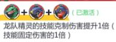
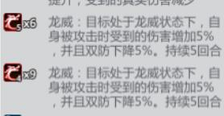
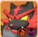
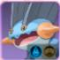
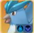
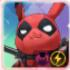
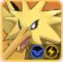

## 新区攻略阵容篇（状态宠）

新区对于氪金200以内的，建议按第一周1SSR 2-3SR 剩下的R卡；两周后最多留一个R卡，开始养第二只SSR。注：SP升星非常容易，可以前期消耗易获得的SSR来升星    

前期SSR的养成速度跟你推塔（冠军之路）的速度有关，前期获得大量大师球的地方，1个主塔和5个副塔分别在60层以后都提供大师球，基本每十层会给3个大师球（一共29*6=174个）。  

现在宠物可以随便养成，图鉴解锁后是星级不可以重生（就是升星的宠物或者百变怪不返还），而养成的沙袋等都会返还。  
注：如果前期养成的SSR吞太多百变怪，建议先不解锁图鉴，等后期重生把百变怪弄出来给稀有宠物（如限时岛）  

状态队分为：火水电毒龙，目前版本水龙毒比较强势。电队和火队由于龙队烈咬陆鲨的原因，地面和龙属性的打击面，加上龙队本身高额的爆发，前期电和火不能存活。氪金和非氪金玩家都推荐玩龙队。龙队对于氪金玩家来说，第25天孵化系统出现，可以获得龙队SP超梦的链接宠物：超梦Y（3闪就非常强势）

## 状态队额外加成 ##   
    
    
需要至少一个状态宠物和一个输出宠物搭配，强化属性克制伤害（前期效果明显）。如SR烈咬陆鲨的地面系克制火和电，龙系克制龙。加上本身的高爆发前期打火电队有极大的优势。  

## 状态队刷新机制 ##    
       
如图，有两个龙威图标，表示的是不同的两只精灵造成的龙威状态。    
1.同一只宠物叠龙威的层数看图标后×的数量，如图标上表示的分别是6层和9层。      
2.每回合造成的状态是独立计算回合数：如，龙威一共是五回合。第一回合造成3层龙威，第二回合造成1层龙威，整体显示的是X4层，在第五回合后变成X1层。      
3.龙威图标右下角表示的是最近一次上龙威的回合数，以2的例子为例，在第二回合重新上一层龙威时，右下角回合数变为5，第三回合变为4。    

## 状态队伍构成 ##     
分为**状态宠物**（提供**异常状态**：燃烧，潮湿，水灵，麻痹，中毒，龙威）和**输出宠物**（在异常状态下输出大幅度增强）   
目前新区只推荐龙，有钱氪原始盖欧卡并且有金影杀的可以玩水队，毒队只建议后期玩，养成配置较高。火电前期下水道，电队必须要暗黑酋雷姆才有强度，虽然爆发最高，但是后续疲软。火队强度需要投入许多资源，主力都需要5闪才有强度。

## 状态队伍性格装备介绍 ##    
**性格推荐**：   
**状态宠物**：不需要任何输出性格！！状态宠物重要的是给对方上状态，需要走肉盾性格。超级勇敢 忧郁（减伤）冷静（回血）是必选性格。  
如果宠物本身坦度够高，可以选择慎重（每回合加护盾）；**比较推荐**  
如果宠物容易被开局秒杀，可以选择急躁（前三回合加双防）；  
如果需要靠宠物卖血给队友减伤，可以选择乐天（血量越低给队友减伤越高）**用的人较少，但是你想极限二保一的话可以选择（比如保超梦，裂空和SSR鲨鱼牺牲自身坦度带乐天）**  
**输出宠物**：建议超级勇敢 和顽皮（增伤）悠闲（半血增伤并且附带吸血）性格，剩下一个性格建议带忧郁（减伤）。  
如果宠物容易被秒，可以尝试减少输出性格，替换成肉盾性格。  
注：暴击宠物（基拉祈和SR烈咬陆鲨）必带勇敢性格。  

**携带物推荐**：  
对于新区的情况 电力增幅器>龙之鳞片（升红才厉害）>充电电池（后期没机会叠防御）  
电力增幅器是输出宠物和防御宠物都适用的一个携带物。  
龙之鳞片第一赛季的时候并不强势，第二赛季升红后半血以上也减伤才厉害。  
充电电池适合所有的状态宠物（站桩）带，但是问题在于，如果面对的阵容输出太过暴力，没有机会叠双防，并且！！！叠的双防是可以被移除的。充电电池并不是不强，只是通用性不如其他两个好。  

**学习机推荐**：（转盘和氪金学习机强度更高，输出宠物目前舍身背水强度比较高）  
状态宠物：  
通用学习机：  
死亡种子（让敌方收到伤害增加）  
汲取（造成百分比伤害并且回复队友生命值）    
转盘学习机：
枯萎（降低对方属性，提高队友对其的伤害）    
             
输出宠物：  
通用学习机：  
战意（每次大招后增伤）       
氪金学习机：  
善恶有报（高额增伤，但是没击杀对方会给对方回复一定血量）    
转盘学习机：  
舍身（降低自身血量和双防换取攻击）       
背水（自身生命越低伤害越高，高品质有免死反杀的奇效）    
尖锐（对方生命越低伤害越高，高品质有破盾效果）    
隐忍 （每回合提升伤害，满提升伤害比善恶还恐怖，缺点是叠伤周期久）  
血怒 （攻击造成自身当前生命百分比伤害，适合水队）  

## 状态队精灵介绍 ## 

**火队**  
**【燃烧】使目标每回合损失血量，伤害值为攻击者的〔攻击+特攻)×0.3，持续5回合。处于燃烧状态的精灵造成的伤害减少8%，最终生命回复降低15%**   
阵容  
状态宠：   
SSR超级喷火龙X（优先）    
开局三能量大招能直接叠两层燃烧状态，主力宠物.    
SSR凤王    
两能量的大招叠火比较慢，适合在后排攒能量再上场。前期资源紧张优先度不如X喷。    

输出宠物：  
SP莱西拉姆（下位SR火焰鸟）链接 SSR焰白酋雷姆  
莱西拉姆整体强度偏低，链接的焰白酋雷姆伤害强度比较吃高闪（有高闪还不如玩其他队伍），整体不推荐。  
SP比克提尼（下位SR波尔凯尼恩）（前期优先）  
大招根据燃烧层数造成大量AOE真实伤害，提升每回合的燃烧伤害，闪光性格提升自身坦度，并不需要高闪。  
SSR闪焰王牌 （秘境岛5）  
在秘境岛5（120训练家等级）不易获取，强度很高，输出非常强力，伤害吃高闪  
SR 炽焰咆哮虎   
过渡宠物伤害中规中矩    

火队的状态【燃烧】自身带有伤害，主力主要是X喷和比克提尼。前期推塔推图主要靠比克的大招打出AOE百分比伤害，并增加燃烧伤害。但是新区现在龙队强势，宠物火和龙属性被SR烈咬陆鲨克制。  
不建议玩火队。  

**水队**    
**【潮湿】处于潮湿状态的精灵造成的伤害降低20%，每层潮湿状态生命回复降低10%，持续4回合，最多4层**    
**【水灵】处于水灵状态的精灵每回合开始提升5%的双防〔最大5层)并回复5%最大生命,持续4回合，获得20%真实伤害抗性**    
阵容  
状态宠：  
SSR水君（下位R巨沼怪）（优先）  
大招附加吸血效果，站桩回血能力强，前期可以选择巨沼怪，易养成，输出也不弱。主力宠物  
SSR超级水箭龟  
大招附带控制效果，但是控制概率会被携带的控制抵抗词条降低。  

输出宠物：  
SP盖欧卡（下位SR急冻鸟）链接  SSR原始盖欧卡（优先）  
盖欧卡强度比较强，打输出主要靠影杀的普攻，大招在对方低血量时附带斩杀效果，链接的原始盖欧卡每回合提升双攻，普攻伤害附加了破盾，不算吃高闪，强度比较吃影杀学习机。  
SP超级暴鲤龙（下位SR暴鲤龙）  
输出需要石板和学习机血怒才有可观的伤害，输出有真空期（龙之舞的回血和强化），整体偏肉。  
SSR卡璞鳍鳍 （秘境岛6）  
在秘境岛6（180训练家等级）不易获取，重击爆发高，属于站桩强化宠，妖精属性克制主流的大黑和龙系宠物。  

水队的主力主要是水君和盖欧卡，SR过渡宠物急冻鸟和暴鲤龙强度不错，水队在推图和打塔比较弱。水队强在防守和续航，在第二赛季的时候水队SR较弱，如果没有盖欧卡推图推塔伤害会比较墨迹。  
前期除了龙队，水队是第二选择。  

**电队**     
**【麻痹】处于麻痹状态的精灵15%概率无法行动，速度降低8%，造成伤害减少10%，持续4回合**   
阵容  
状态宠：  
SSR皮神（优先）  
大招群体麻痹，闪光性格让对方持续百分比掉血，重击减对方能量和输出（优先）  
SSR卡噗鸣鸣  
大招附加的麻痹层数比皮神多，缺点是只能给单体上麻痹，比较适合搭配死侍皮卡丘。  

输出宠物：  
SP捷克雷姆（下位SR雷丘）链接SSR暗黑酋雷姆（优先）  
捷克雷姆强度不错，大招附带的真伤容易推塔推图，建议开局重击移除麻痹增加伤害，闪光性格是生命越低伤害越高。链接的暗黑酋雷姆闪光性格是生命越高伤害越高，高闪附带杀敌回能量效果。  
SP死侍皮卡丘（下位SR闪电鸟）  
设计上是个很强的单体爆发宠物，重击电能状态下有高额的爆发和斩杀效果，高闪击杀对方偷取双攻，但是由于是单体宠物，而且电队状态【麻痹】本身没有伤害，容易被针对磨死。  

电队的主力主要是皮神和捷克雷姆，SR过渡宠物雷丘强度不错，电队在推图和推塔强势。但是由于现在新区SR烈咬陆鲨的原因，电队难以存活。  
不建议玩电队。  

**毒队**    
**【中毒】使目标每回合损失血量，伤害值为攻击者的（攻击+特攻）×O.4。中志状态的精灵生命回复降低10%，持续5回合**  
阵容  
状态宠：  
SSR基格尔德（优先）  
大招群体中毒，闪光性格提供了较强的续航，不算吃高闪。基格尔德的强度在于隐杀的普攻能快速叠毒  
SSR超级妙蛙花  
大招群体中毒（但是中毒概率只有80%），能极大的强化中毒伤害，缺点如果没有高闪本身的威胁性很小，最好是5闪再玩。  

输出宠物：  
SP超级耿鬼（下位SR耿鬼）  
超级耿鬼作为第二赛季的道馆碎片宠物，强度在石板出来后得到了极大的增强，在配合高闪状态宠物下，可以开局大招爆毒直接带走对方一只宠物。缺点是爆发极其依赖大招，如果没有秒掉对方的宠物后续伤害不足。  
SP 露奈雅拉（下位SR达克莱伊）链接拂晓之翼（优先）  
高闪性格降低对方宠物全属性，露奈雅拉偏向于辅助位，开局重击，给友方回复生命和护盾。链接宠物拂晓之翼输出更加可观，可以当做输出位。  

毒队的主力主要是基格尔德和露奈雅拉，SR过渡宠物并不好用，毒队属于大后期的阵容，伤害吃属性面板和装备影杀或者五闪。在毒队面前生命回复这一效果会大打折扣，如果不集火基格尔德局面会变得很被动。  
不推荐前期玩，后期装备性格足够后再养成。  

**龙队**    
**【龙威】处于龙威状态的精灵受到的伤害增加5%双防降低5%，持续5回合**    

状态宠：  
SSR超级烈咬陆鲨（优先）  
大招偷取2能量给攻击最高的宠物，优先养成可以无限大招刷龙威，配合战意打出极高的伤害，不算吃高闪。  
SSR裂空座  
大招群体3层龙威，额外降低敌方双防，给输出最高提供吸血效果，3闪在半血以下时能让对方受到伤害增加，但总体功能性不如超级烈咬陆鲨，可以作为4号位的宠物，天赋选择登场受到伤害减免。  

输出宠物：  
SP基拉祈（下位SR烈咬陆鲨）（优先养成烈咬陆鲨）  
基拉祈作为第三赛季的道馆碎片宠物，强度并不突出。首先基拉祈作为输出，攻击种族值太过平庸，第二，作为暴击宠物非常需要高闪来支撑暴击率和暴击伤害，同养成下输出远差于超梦。然而SR烈咬陆鲨易养成输出高，强烈推荐。  
SP 超梦（下位SR快龙）链接 超级超梦Y（120图鉴可以培养）  
综合属性超强，3闪击杀回复能量，五闪击杀提供永久伤害增加和回血。大招和重击的爆发非常容易将对方击杀。  

龙队的主力主要是超级烈咬陆鲨和SR烈咬陆鲨，SR快龙的强度并不理想，不建议养成。对于氪金玩家可以选择超梦，超级烈咬陆鲨和裂空座首发，SR烈咬陆鲨四号位。SR烈咬陆鲨在第二赛季依然强势，后续石板养成不如SSR。  
强烈推荐不管是不是氪金玩家都玩，目前是不管前中后期都很强势的阵容。  