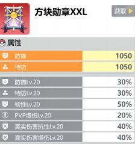
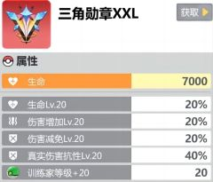
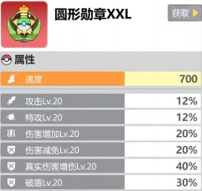
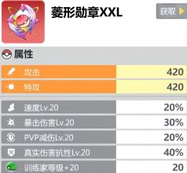
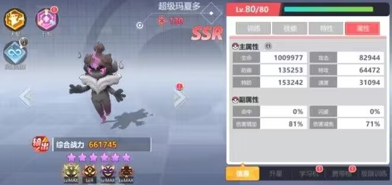
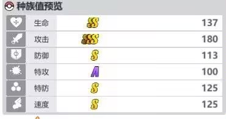
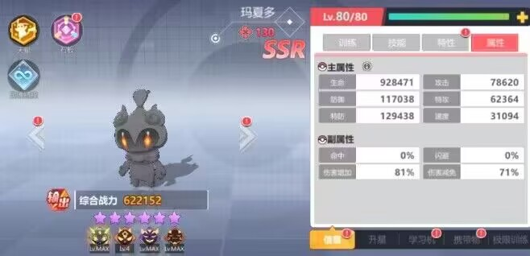
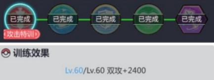
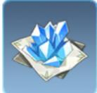
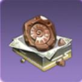

## 精灵战斗力养成（萌新篇）

## 主要内容：主角等级；主角服装；主角纯晶；主角勋章；收集册；精灵种族值；精灵星级；精灵个体值；精灵性格；精灵天赋；学习机；携带物；极限训练；神奇石板

## 主角等级
开启主角宝箱（60彩钻一次）有 概率获得（**相册 z纯晶 服装**）和比获得200钻石  
主角等级通过相册升级，需要通过相册升级每多一级开启一个z纯晶槽，上限为4个槽。新区建议升到8级（需要142本相册，性价比最高，解锁Z纯晶两轮释放）之后提升等级只提升基础属性。  
紫色以下的纯晶可以背包出售为1相册，紫色出售为3相册，紫色以上纯晶不建议出售。  

## 主角服装
通过主角宝箱获得。（主角宝箱前期可能会被炒价格，这东西后期不值钱）  
每个角色都有对应的衣服，紫色加固定值属性，橙色加百分比属性，部分橙色衣服需要在活动氪金获取。这些衣服的属性加成只要激活全部都会生效（玩家最好全收集）  
橙色衣服到后面都会降价得厉害（400-1000彩钻），前期不需要急着凑齐，这不是影响前期战斗力的主要因素。  
 
## 主角纯晶
开启主角宝箱获得，新区推荐  
能量球（开局炸对方全体血量）  
固若金汤（在没有大招的回合规避伤害）  
火雨（对方精灵分摊12次百分比伤害，如果对方只剩一只，基本相当于半血斩杀【红色45%最大生命值】）  
护盾（能为本方全场目标提供百分比生命护盾）  

场地纯晶（只要带一种就好）  
火队--光照气候  
水队--暴雨气候  
电队--闪电气候  
毒队--毒物场地气候  
龙队--超能场地  

场地分为两个效果  
1增强场上**所有**纯晶对应队伍的伤害能力  
2针对**我方**的强化（如超能场地强化普攻重击伤害，暴雨气候提供我方回血，敌方伤害降低的效果，这两个效果适用所有阵容）  

## 主角勋章（新区第15天）  
通过训练家联赛获得，通过训练家等级划分战区  
1-50黑铁；51-100青铜；101-160白银；  
161-220黄金；220-300钻石；301-450天王；  
冠军获得12碎片，20碎片合成一个勋章。  
只有黄金组及以上的碎片可以合成红色勋章  
极品红色勋章是词条全20（大多数人基本是在15左右）  
勋章基本是稀有词条，氪佬可以在段位高的时候再去购买 礼包（段位越高，给的东西越好）   
注：黑铁的时候买是开黑铁的，屯着段位高再开没用。   
    
     

## 收集册
1.不升训练家等级，只加基础属性  
N R 10星  SR 9星  
SR除了养成的宠物不要特意抓，用精灵球和工会等白嫖的SR碎片，加上抽卡可以在1个月半的时候白嫖9星；  
R卡前期不优先完成10星，R卡比SR难，没有额外获取途径，等银币抽卡或者消耗球捕捉（不建议）  
N卡同上，不过N卡红白球100%抓到，比R卡收集容易  

2.升训练家等级和基础属性  
普通SSR：7星加1；12星加3  
稀有SRR：7星加3；12星加6  
SSR在收集 闪光5和130个体分别加1  
SP：3星加1；12星加3（收集优先度低）  
注：前期除了主力宠物，尽量不要把百变怪喂给普通SSR。SP尽量用溢出的SSR升星。  

3.通过勋章提升等级  
三角勋章和菱形勋章  

训练家等级作用：  
1.18:00开启的秘境岛  
30级秘境岛2；50级秘境岛3；80级秘境岛4；  
120级秘境岛5；180级秘境岛6；  
2.训练家联赛  
1-50黑铁；51-100青铜；101-160白银；  
161-220黄金；220-300钻石；301-450天王；  
3.额外战斗效果加成  
10-200级每十级有额外战斗效果加成（如200lv精灵攻击时，如果目标能量高于自身，造成的伤害提升25%）  
4.领取奖励  
120 3闪百变怪；150狮子链接；200 5闪百变怪；220 鹿链接；230无极链接；  

## 精灵种族值
  
  
所有的基础属性（比如训练家等级，沙袋训练等）都会根据宠物的种族值修正  
如超级玛夏多（大黑）和玛夏多（小黑）只有速度的修正一样  

## 精灵星级  
R和SR和SSR（SP）升星提升的百分比不一样  

|           | R         | SR	   |  SSR	    |
| --------  | --------  | ------ |------	  |
|6星双防（28级）5w金币    |9%**（4）** | 10%**（4）** |11%**（2）**  |
|7星双攻（28级）10w金币   |9%**（5）**  | 10%**（5）** | 11%**（3）**  |
|8星生命（40级）15w金币   |19.5%**（6）** | 21%**（6）** |26%**（3）**  |
|9星双防（44级）20w金币   |19.5%**（6）** | 21%**（6）** |26%**（4）**   |
|10星双攻（48级）25w金币  |19.5%**（10）** | 21%**（10）** |26%**（6）**  |
|11星增伤（51级）30w金币  |18%**（20）** | 20%**（20）** |24%**（12）**   |
|12星减伤	|              18%	 |  20%	 |24%   |

加深处为突破到下一级所要消耗的精灵数量（购买648升星百变怪的玩家建议用在11星突破上）  
后期除了功能性强的SR梦幻和综合属性不弱的SR烈咬陆鲨，基本都要换成SSR。  

## 精灵个体值   
60 21.6%全属性提升  
考虑到后期抓宠再差也是100个体  
100 38.7  
110-130 0.4*每级+3.6每突破  
110 44.1  
120 51.3  
130 58.5  

## 精灵性格
每只宠物独有的**超级勇敢**（闪光性格）lv1-5有额外的属性加成  
所有性格在**3级**和**5级**的时候会有附加的提升：如固拉多闪光在3级时会让对方双攻最高输出减低20%，5级额外降低双攻20%；顽皮在3级的时候触发概率提升到80%，5级时提升到100%；  
通用性格   
攻击: 顽皮（提升伤害百分比）；悠闲（低生命值的时候提升伤害，并附加吸血）；勇敢（暴击宠物专属，提升暴击率和暴击伤害）注：游戏没有基础暴击率，非暴击宠物不建议装此性格  
防御：忧郁（提高伤害减免）注：所有宠物都能装，适用性广；冷静（每回合结束回复部分已损失生命）；急躁（提升百分比双防）；慎重（每回合获得百分比护盾）；  
注：急躁和慎重这两个性格的选取，急躁是只有首次登场的时候生效，并且每回合提升的衰减20%，第三回合后停止衰减，而慎重的百分比每回合都有；如果你怕宠物被直接秒（鹿这类的宠物）带急躁，站桩的宠物（无极汰那这类宠物）带慎重。附攻防转换自行判断：  
| 攻击        |防御	   | 造成伤害	    |
| --------  | ------ |------	  |
|50	 | 50| 25  |
|50	 | 100| 16.6667  |
|50	 | 150|  12.5   |

辅助性格：乐天（生命越低给队友的减伤越高）  
## 精灵天赋
第一层 生命 物防 特防  
第二层 首次登场能量+1  首次登场减伤 半血减伤  
第三层 物防 特防 双攻  
第四层 必杀后刷护 必杀后增伤 强化必杀技  
第五层 生命 双防 速度  
第六层 普攻强化 重击强化  

基础属性：一三五层，新区大多数是小鲨鱼，建议堆物防。这部分怎么选完全看你主要面对的敌人是什么类型的输出。（大鲨鱼抢速度减能量，第五层可以点速度）  
第二层：首发宠物基本是加能量，或者选减伤骗对方大招，第二回合再输出。后排宠物和轮换抗伤宠物可以选半血减伤和登场减伤。  
第四层：选强化必杀技  
第六层：看宠物机制，比如盖欧卡普攻伤害比较强就普攻强化，超级巨钳螳螂靠重击打爆发就强化重击。  

## 学习机  
学习机品质从**白，绿，蓝，紫，橙，红**需要成功突破5次。中途失败一次即削减一次品质上限（比如失败一次，学习机最高橙色），突破等级分别为10.20.30.40.50，对于突破失败的学习机，不建议继续提升（除了影杀学习机）  

新区只建议**战意**（放大后增伤，可叠加），还有兑换所（兑换所绿色起步，氪金可以紫色起步）的**浴血**（让对方受到自身损失生命的百分比真伤）和**时空之刃**（受过的伤害百分比反弹对方，并减少对方回复能力）  

升级材料推塔可以得（养成学习机材料需求量大）  

## 携带物
6个位置的携带对应词条内容是固定的。**前期**携带物获得蓝色和紫色携带物可以通过世界boss活动获得。橙色携带物可以通过氪金，开启携带物宝箱（每日世界boss产出）和石英大会获得（数据升级）。  
蓝色携带物主属性只有**固定数值**加成（不建议花资源养成）  
紫色携带物主属性分为**固定数值**（不建议）和**百分比**加成（平民可以养成过渡）  
橙色携带物主属性分别为**固定数值**（不建议升高星）和**百分比**加成（最推荐），可以通过神石升级为红色。  
**完美携带物**是左上角带有，是百分比主属性和初始5词条的携带。但是极品携带物是强化全部在宠物需要的词条（如输出宠物的无视防御）  

成套携带物的加成是4+2  
如电力增幅器（电箱）*4触发每回合附加宠物双攻的护盾效果。  
而2件套除了**秘境**获得的附着针（破盾和减伤）还有金刚宝珠（真实伤害抗性和韧性），其余都是固定属性加成  
新区**氪金**的携带物兑换：电力增幅器>龙之鳞片（升红才厉害）>充电电池（后期没机会叠防御）  
注：商店的700彩钻携带物和10彩钻勋章不要买，谁买谁大冤种。  

## 第二赛季 极限训练（第二赛季开放）
  
对应攻击，防御，生命，全能（攻防生命都有加）训练书  
和特殊训练书  
SSR级别的特训书只能通过648氪金，两个轮一次（两个月）的68通行证，或者特殊活动氪金兑换  
SR及以下级别可以通过8000积分兑换低阶特殊训练书  
满集训需要1本特殊训练书和  
270 540 1170 1350本普通训练书（消耗按顺序递增）  
  
越靠后的特训加成越高  
如攻击  2400 2700 3000 3300 3600  
特殊训练效果也是  
如顺境LV4 双防提升40伤害提升24  
  顺境LV5 双防提升50伤害提升30  

## 第三赛季 神奇石板  
条件：第三赛季开启，或者第二赛季训练家等级达到120级可以提前开启（要把主塔140层通过）  
岩石砾强化1-40矿石砾强化41-55；  
化石砾强化56-70；黑金炭 强化石板星级  
满级石板为6星70级，需要材料8210岩石砾；7050矿石砾；9300化石砾升级。156黑金炭升星。  
通用石板  
盾（上）生命提升；左（剑）右（盾）均为双攻双防提升  
专属石板（中）  
对宠物技能或者机制的强化，等级加属性，星级强化机制效果。如超级暴鲤龙星级强化大招附带8%（1星）--50%（6星）的双攻真伤，重击强化自身1.3%（1星）--8%（6星）双防双攻  
专属石板获取  
120碎片合成一个专用石板  
通用宠物：远古遗迹  
  
状态宠物  
  

